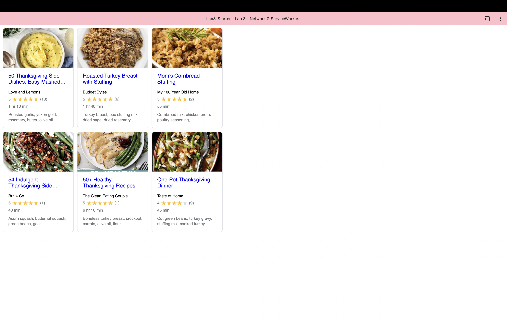

# Lab8-Starter

Name: Sahana Narayanan

GitHub Pages url: https://sahananar.github.io/Lab8-Starter/

Service workers and graceful degradation both contribute to improving the user experience while using web applications. Service workers work to manage network requests and help applications function offline, as we saw in this lab. This connects to the concept of graceful degradation, which entails designing applications to provide a high level of functionality on more advanced systems. Using service workers would help make sure that our softwares degrade gracefully. 

